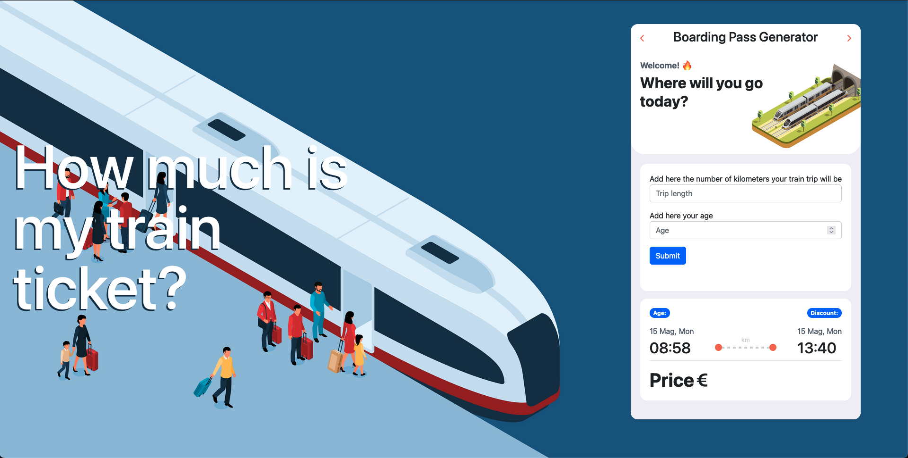
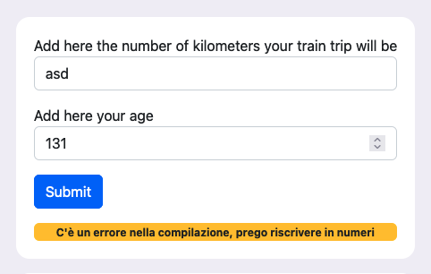
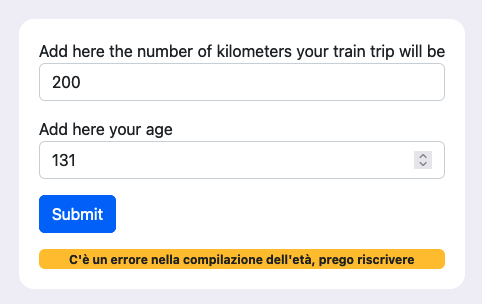

# js-biglietto-treno-form
This is a train ticket calculator that works withouth prompts.
  

  
<h1>- WHAT IT DOES -</h1>
This program calculate a train ticket price. The price is 0.2333 euros for kilometer. 
The user will put in the form the lenght of the travel they wanto to do, their age, and sumbmit. 
If the buyer is underage, they have a 19.4% discount. 
If the buyer is an elder (over 65), they have a 37.7% discount. 
  
<h1>- ERRORS -</h1>
 
<h2>- Datas in text instead of numbers-</h2>
 
If the user will write the lenght of the trip, or the age in text instead of numbers, the program will stop the calculation and produce an error that will tell the user to write in numbers.
  
<h2>- Unrealistic Age -</h2>
 
If the user will write a age number that is too big or too small to be possible (in this case > 130 years or < 0), the program will stop the calculation and produce an error that will tell the user to rewrite the age.

